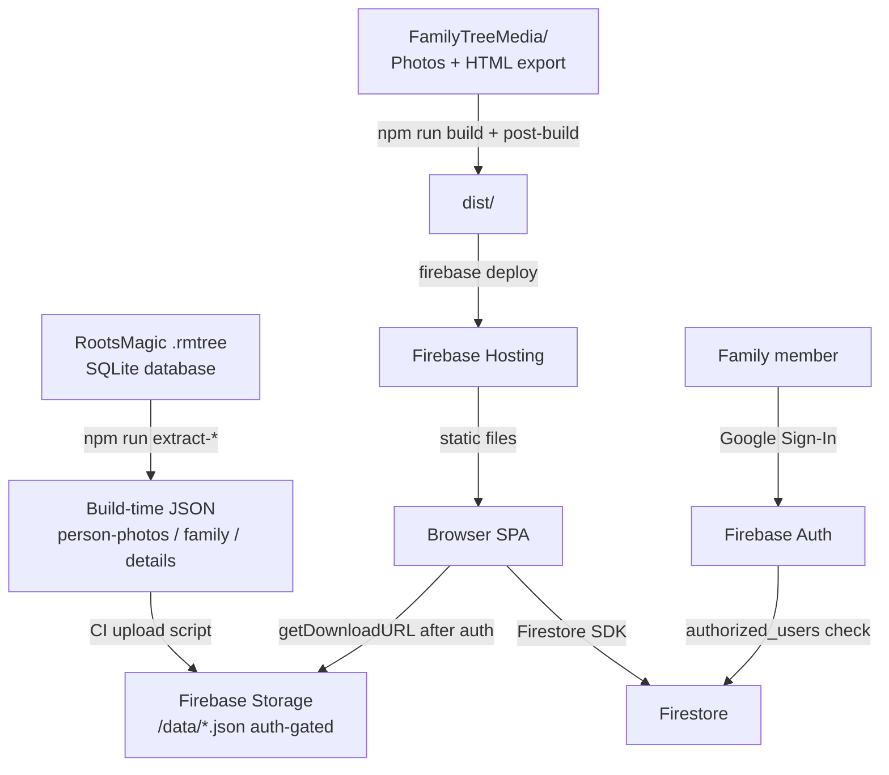

# Living Family Archive

**A private, invite-only family history archive — searchable genealogical profiles, 685+ photographs, and life event records, served as a fast static web app.** _(GitHub repo: `xfaith4/FreshStartFamily`.)_

[](https://github.com/xfaith4/FreshStartFamily/actions/workflows/deploy-production.yml)
[](https://github.com/xfaith4/FreshStartFamily/actions/workflows/deploy-staging.yml)


**Keywords:** family tree, genealogy, RootsMagic, Firebase, Vite, vanilla JavaScript, photo gallery, private archive, invite-only, Google OAuth, Firestore, family history app

---

## Why this exists

Most genealogy platforms are built for researchers. This project is built for families — non-technical relatives who want to browse people, photographs, and records in a calm, welcoming experience without creating accounts on third-party services. It wraps a [RootsMagic](https://www.rootsmagic.com/) database export into a fully in-app browsing experience, gated by Google Sign-In and a simple admin invitation workflow.

---

## Key Features

- **512 family member profiles** — name, life events, sex, birth/death dates extracted from RootsMagic database at build time
- **685 photographs** with an in-app lightbox, captions, and person chips that link directly to profiles
- **Cited Sources library** — expandable citation records with source-type badges, family/place links, and filterable research context
- **User-centered Family Tree** — Bloodline, Household, Explore, and Me-centered Relationship Lens modes keep direct lines, family units, and selected-person connections readable at scale
- **Contextual back navigation** — returns to gallery, surnames, or search exactly where the user came from
- **Admin panel** with seven tabs: Users, Feedback, Submissions, Profile Edits, Media Links, Photo Uploads, and Diagnostics
- **Structured "Suggest a Change" workflow** — factual corrections and photo contributions routed to admin review; citations encouraged but never block submission
- **Manual media linking** — admins can associate any photo with any person from within the app, without a rebuild
- **One-click invite copy** — pre-written invitation message with app URL, ready to paste
- **Invite-only access** — Google OAuth + Firestore authorization; no public sign-up
- **Build-time data extraction** using Node.js built-in `node:sqlite` — no external DB driver needed
- **JSON-first in-app profiles** — profile details, family relationships, and linked photos now render directly inside the SPA

---

## Quickstart

### Prerequisites

| Tool | Version |
| --- | --- |
| Node.js | ≥ 22 (uses `node:sqlite` built-in) |
| npm | ≥ 10 |
| Firebase CLI | ≥ 13 — `npm install -g firebase-tools` |

```bash
# 1. Clone and install
git clone https://github.com/xfaith4/FreshStartFamily.git
cd FreshStartFamily
npm install

# 2. Configure environment
cp .env.example .env
# Edit .env with your Firebase project values (see Configuration below)

# 3. Start dev server (hot-reload)
npm run dev
# → http://localhost:5173
```

The local dev server enables Google Sign-In using your real Firebase project. For offline-only development, set `VITE_LOCAL_DEV_PASSWORD` in `.env` — a local password login button appears automatically on `localhost`.

---

## Installation (Full)

### 1. Firebase project setup

You need a Firebase project with:

- **Authentication** → Google provider enabled
- **Firestore** → production mode, rules deployed (see `firestore.rules`)
- **Hosting** → configured (handled by `firebase.json`)

Follow the step-by-step guide in [SETUP_GUIDE.md](./project-docs/operations/SETUP_GUIDE.md).

### 2. RootsMagic data files

Place your `.rmtree` database and exported media inside `FamilyTreeMedia/`:

```text
FamilyTreeMedia/
├── YourTree.rmtree          # RootsMagic database (SQLite)
├── Total Family/            # HTML export from RootsMagic (names.htm, surnames.htm, f*.htm)
└── YourTree_media/          # Photos associated with the tree
```

Update `DB_PATH` in each script under `scripts/` to point to your `.rmtree` file if it differs from the default.

### 3. Extract build-time data

Run the extraction scripts once (re-run whenever your RootsMagic data changes):

```bash
npm run extract-person-photos    # → person-photos.json
npm run extract-person-family    # → person-family.json
npm run extract-person-details   # → person-details.json
```

These scripts require Node 22+ (built-in `node:sqlite` module; no external DB driver).

### 4. Build

```bash
npm run build
# Runs: catalog-photos → build-directory → build-cited-sources → vite build → post-build
```

---

## Configuration

All runtime configuration is injected at build time via Vite's `import.meta.env`.

### `.env` file

```bash
cp .env.example .env
```

### Environment variables

| Variable | Required | Description |
| --- | --- | --- |
| `VITE_FIREBASE_API_KEY` | ✅ | Firebase Web API key |
| `VITE_FIREBASE_AUTH_DOMAIN` | ✅ | `<project-id>.firebaseapp.com` |
| `VITE_FIREBASE_PROJECT_ID` | ✅ | Firebase project ID |
| `VITE_FIREBASE_STORAGE_BUCKET` | ✅ | `<project-id>.firebasestorage.app` |
| `VITE_FIREBASE_MESSAGING_SENDER_ID` | ✅ | Messaging sender ID |
| `VITE_FIREBASE_APP_ID` | ✅ | Web app ID |
| `VITE_ADMIN_EMAIL` | ✅ | Google account email that receives admin privileges |
| `VITE_LOCAL_DEV_PASSWORD` | ☐ | Dev-only. Enables a local password login on `localhost`. Never sent to any server. |

> ⚠️ Never commit `.env` with real values. The `.gitignore` excludes it by default.

---

## Usage

### Running locally

```bash
npm run dev          # Dev server at http://localhost:5173
npm run preview      # Preview the production build locally
```

### Building for production

```bash
npm run build
```

Build output lands in `dist/`. `FamilyTreeMedia/` assets are copied to Hosting output, while protected JSON data files are uploaded to Firebase Storage (`data/`) by CI for authenticated runtime access.

### Release verification

```bash
npm run verify-release
```

This is the standard local release gate. It requires Node 22+, runs the build, and validates the protected JSON artifacts before staging promotion. Manual staging smoke checks live in [RELEASE_CHECKLIST.md](./project-docs/operations/RELEASE_CHECKLIST.md).
It also runs an emulator-backed governance integration test, which requires Java 21+.

For governance hardening, run the read-only integration harness directly when needed:

```bash
npm run test-governance-integration
```

This emulator-backed test verifies historical browsing reads remain available in `historical_read_only` mode while collaboration writes are denied in Firestore, Storage, and the profile-edit callable.

### Deploying

```bash
firebase use production      # Switch to prod Firebase project
firebase deploy              # Deploy hosting + Firestore rules
```

For staging:

```bash
firebase use staging
firebase deploy
```

GitHub release policy:

- Feature work merges into `staging`
- `staging` is the only branch that should be promoted into `main`
- Production deploys only after the GitHub PR `staging -> main` is merged
- The workflow `Enforce Release Flow` blocks direct feature PRs into `main`

### Re-extracting data after a RootsMagic update

```bash
npm run extract-person-photos
npm run extract-person-family
npm run extract-person-details
npm run verify-release
```

### Family tree — keyboard shortcuts

The Family Tree is centered around the signed-in user's linked family member. Bloodline mode emphasizes the direct ancestral line, Household view clarifies nearby family units, Explore mode keeps broader branches available, and the Me-centered Relationship Lens explains visible people relative to you. Selecting a person highlights the visible route back to your linked profile and smoothly brings the expanded tile to a readable size, even from a far zoom.

When the tree view is open and focus is not in a text input:

| Key | Action |
| --- | --- |
| `←` `→` `↑` `↓` | Pan 120 rendered pixels in that direction (animated, interruptible) |
| `+` or `=` | Zoom in (centred on viewport midpoint) |
| `-` | Zoom out (centred on viewport midpoint) |
| Mouse wheel | Zoom in / out (native Cytoscape behaviour, always active) |

Typing in the **Find person** search box suspends keyboard pan/zoom so the keys reach the input normally. Mouse-drag panning is always available regardless of keyboard state.

### Admin workflows

| Action | Where |
| --- | --- |
| Invite a family member | Admin panel → Users tab → enter email → Send Invite → copy the pre-written message |
| Review feedback | Admin panel → Feedback tab → Resolve or Dismiss |
| Review suggested changes | Admin panel → Submissions tab → Approve or Reject |
| Review evidence uploads | Admin panel → Evidence tab → approve or decline the artifact; review linked suggestions independently |
| Link a photo to a person manually | Admin panel → Media Links tab → search person → search photo → Link |
| Remove a manual media link | Admin panel → Media Links tab → Existing Manual Links → Remove |
| Link a user to their family member | Admin panel → Users tab → Link button next to each user row |

---

## Architecture

### High-level data flow



### Repository layout

```text
FreshStartFamily/
├── .github/workflows/           # CI/CD — staging and production deploy
├── FamilyTreeMedia/             # RootsMagic database + photos (not tracked in public forks)
├── functions/                   # Firebase Cloud Functions (optional email invitations)
├── scripts/
│   ├── catalog-photos.js        # Scans FamilyTreeMedia/ → photo-catalog.json
│   ├── extract-person-photos.js # RootsMagic → person-photos.json
│   ├── extract-person-family.js # RootsMagic → person-family.json
│   ├── extract-person-details.js# RootsMagic → person-details.json
│   └── post-build.js            # Copies FamilyTreeMedia assets into dist/ (JSON is uploaded to Storage by CI)
├── src/
│   ├── main.js                  # Application logic, DOM bindings, Firebase calls
│   ├── family-data.js           # Data loading, search, photo/family accessors
│   ├── firebase-config.js       # Firebase init (reads VITE_* env vars)
│   └── styles/main.css          # All CSS (responsive, CSS variables)
├── index.html                   # Single HTML entry point
├── vite.config.js               # Vite config (__APP_VERSION__ injection)
├── firebase.json                # Hosting + Firestore rules config
├── firestore.rules              # Role-based Firestore security rules
├── .env.example                 # Environment variable template
└── .firebaserc                  # Firebase project aliases (production / staging)
```

### Firestore collections

| Collection | Writers | Readers |
| --- | --- | --- |
| `authorized_users` | Admin only | Owner (self-read) |
| `feedback` | Any authorized user | Admin only |
| `submissions` | Any authorized user | Admin only |
| `evidence_uploads` | Any authorized user can create pending uploads | Admin, owner, or approved evidence viewers |
| `media_links` | Admin only | Any authorized user |
| `person_profile_overrides` | Cloud Function only | Any authorized user |
| `person_change_log` | Cloud Function only | Admin only |
| `admin_notifications` | Cloud Function only (`read/update` by admin) | Admin only |

---

## Development

### All commands

```bash
npm run dev                       # Hot-reload dev server
npm run build                     # Full production build
npm run preview                   # Preview dist/ locally
npm run catalog-photos            # Regenerate photo catalog only
npm run extract-person-photos     # Re-extract photos from RootsMagic DB
npm run extract-person-family     # Re-extract family relationships
npm run extract-person-details    # Re-extract life event details
```

### Local dev tips

- Set `VITE_LOCAL_DEV_PASSWORD` in `.env` to bypass Google Sign-In on `localhost`.
- The `extract-*` scripts require the `.rmtree` database at the path configured inside each script. The output JSON files can be committed so collaborators don't need the raw database.
- `npm run dev` does **not** run extraction or catalog scripts — run them manually once after a RootsMagic data update.
- Keep a separate staging Firebase project to avoid polluting production data during development.

### CI/CD

| Branch | Workflow | Firebase project |
| --- | --- | --- |
| `main` | `deploy-production.yml` | production project |
| `staging` | `deploy-staging.yml` | staging project |

Both workflows: checkout → Node 22 → `npm ci` → `npm run build` (with `VITE_*` secrets injected) → `firebase deploy`.

Release policy:

- New feature work lands on `staging` first and reaches production only through a PR from `staging` into `main`
- `main` should have GitHub branch protection enabled to require PRs and the `Enforce Release Flow` check

Required GitHub repository secrets:

```text
PROD_FIREBASE_API_KEY               STAGING_FIREBASE_API_KEY
PROD_FIREBASE_AUTH_DOMAIN           STAGING_FIREBASE_AUTH_DOMAIN
PROD_FIREBASE_PROJECT_ID            STAGING_FIREBASE_PROJECT_ID
PROD_FIREBASE_STORAGE_BUCKET        STAGING_FIREBASE_STORAGE_BUCKET
PROD_FIREBASE_MESSAGING_SENDER_ID   STAGING_FIREBASE_MESSAGING_SENDER_ID
PROD_FIREBASE_APP_ID                STAGING_FIREBASE_APP_ID
PROD_ADMIN_EMAIL                    STAGING_ADMIN_EMAIL
FIREBASE_SERVICE_ACCOUNT_PROD       FIREBASE_SERVICE_ACCOUNT_STAGING
```

---

## Security

- All photo paths are validated against a trusted prefix (`FamilyTreeMedia/`) before loading
- Firestore security rules enforce role-based access — see [`firestore.rules`](./firestore.rules)
- In-app profile edits are limited to `nickname` and `profileNote` in `v2.5.0`; every save writes an override, an immutable audit log entry, and an admin notification document
- `v2.6.0` preserves exact source citations in-app while adding plain-language record summaries, linked relatives, related places, and optional external source links
- `v2.7.1` improves Family Tree orientation with lineage-first views, me-centered relationship tracing, and selected-tile readability at low zoom
- `VITE_LOCAL_DEV_PASSWORD` is only active on `localhost` and is never transmitted to any server
- Environment variables with sensitive values are injected at build time from GitHub Secrets — never baked into source

To report a security issue, open a [GitHub Issue](https://github.com/xfaith4/FreshStartFamily/issues) marked **[Security]** or contact the repository owner directly.

---

## Contributing

See [CONTRIBUTING.md](./CONTRIBUTING.md) for coding standards, the PR workflow, and the pre-submission testing checklist.

---

## Additional Documentation

| File | Purpose |
| --- | --- |
| [project-docs/README.md](./project-docs/README.md) | Documentation index and navigation map |
| [SETUP_GUIDE.md](./project-docs/operations/SETUP_GUIDE.md) | Step-by-step Firebase project setup |
| [TROUBLESHOOTING.md](./project-docs/operations/TROUBLESHOOTING.md) | Common issues: auth, Firebase, deployment |
| [RELEASE_CHECKLIST.md](./project-docs/operations/RELEASE_CHECKLIST.md) | Staging and production release verification checklist |
| [ROADMAP.md](./ROADMAP.md) | Release history and planned features |

---

## Topics to add on GitHub

```text
genealogy  family-tree  rootsmagic  firebase  vite  vanilla-javascript
google-oauth  firestore  photo-gallery  static-site  invite-only  family-history
```

---

## License

No `LICENSE` file is present. All rights reserved by the repository owner. This is a private family history application; personal/family forks are welcome, but redistribution or commercial use requires explicit permission.

---

*Built with Vite 8, Firebase 12, and Node.js 22 — no frontend framework.*
